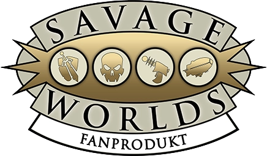
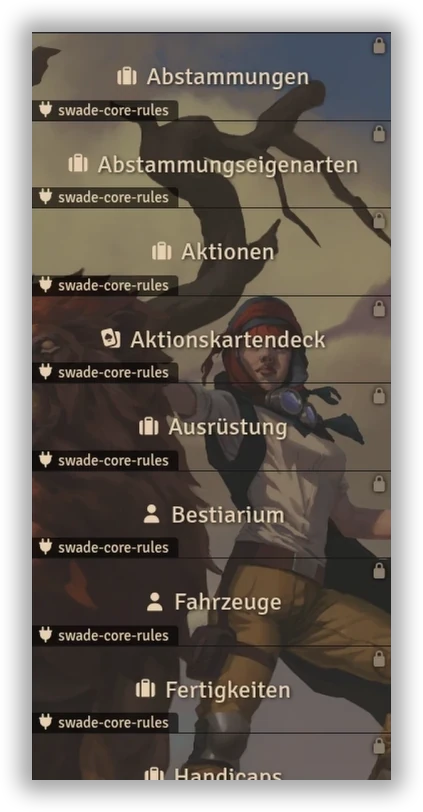
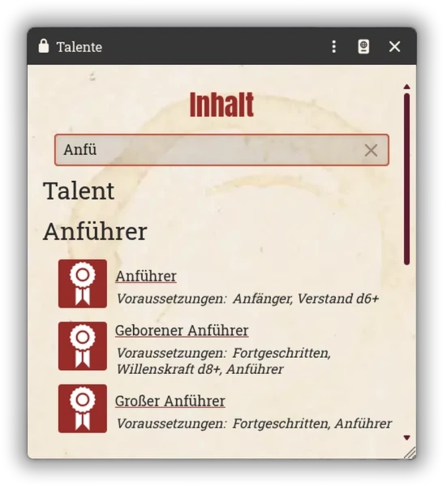
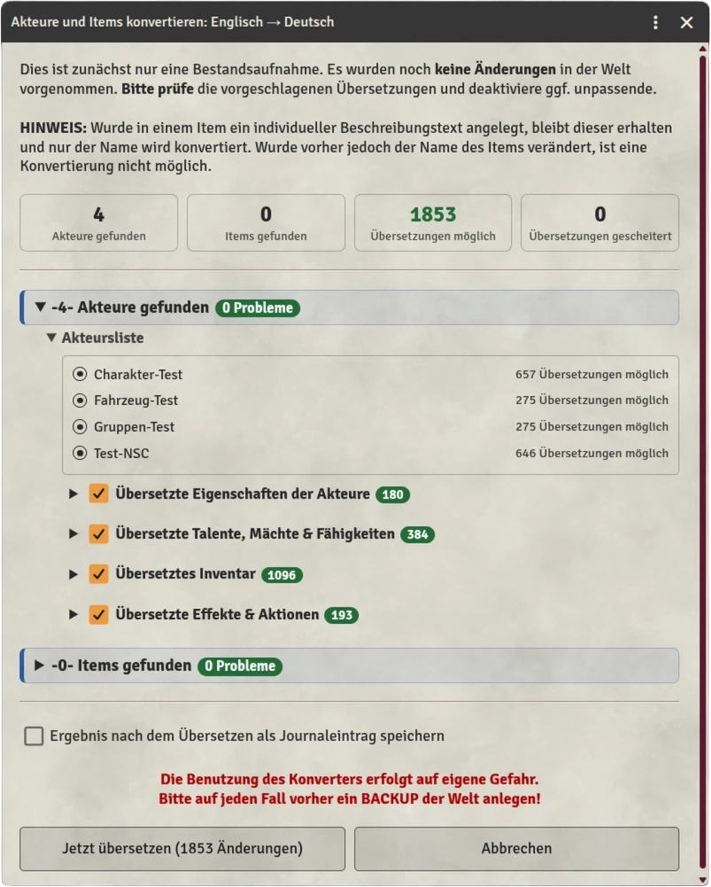
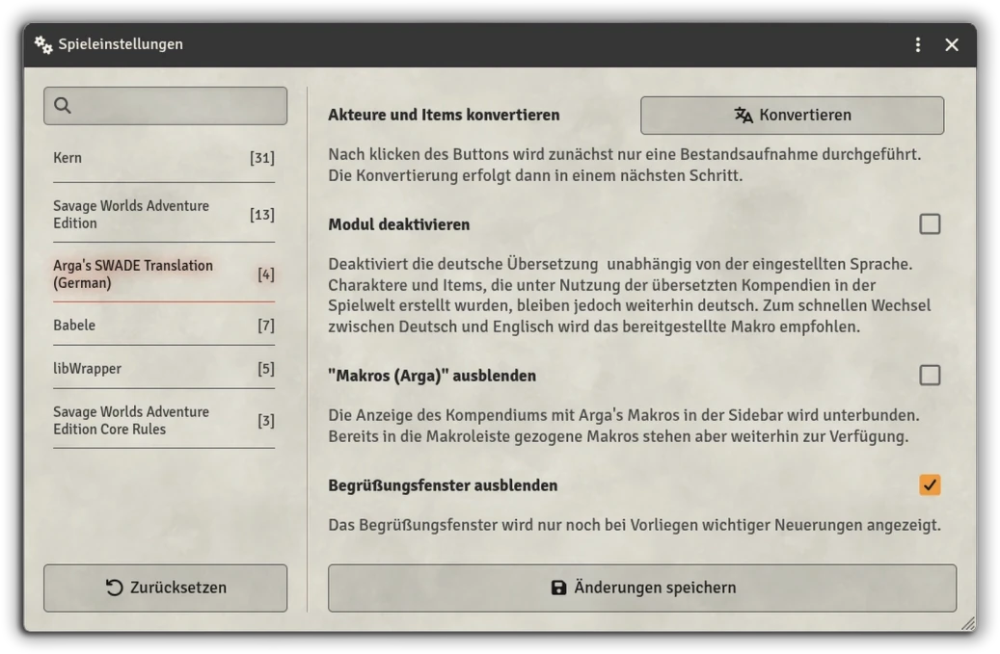

  
  
  
  

  

# Arga's SWADE Translation (German)

Dieses inoffizielle Modul übersetzt alle Kompendien-Inhalte des offiziellen (kostenpflichtigen) englischen ***SWADE Core Rules***-Moduls von Pinnacle für Foundry VTT zur Laufzeit ins Deutsche. Die Übersetzung wird über das Modul ***Babele*** realisiert und die Originalinhalte werden dabei nicht verändert. 
Die deutschsprachigen Texte basieren auf dem deutschen Grundregelwerk (6. Auflage) und dem ehemaligen Foundry-Modul ***Savage Worlds Abenteuer Edition Grundregelwerk*** von Ulisses. Letzteres hatte noch die 3. Auflage des Regelwerkes als Grundlage. Die Texte des vorliegenden Moduls entsprechen aber vollständig der 6. Auflage. Eine Genehmigung zur Nutzung der Texte und Bilder liegt vor. 

  

Alle Kompendien sind deutsch sortiert und die Suchfelder funktionieren mit deutschen Begriffen (auch mit Umlauten). 

  

## Zusätzliche Features
In dem Kompendium-Ordner ***Makros (Arga)*** befinden sich zwei Makros: 
- Mit dem einen kann das Foundry-Interface zwischen Deutsch und Englisch umgeschaltet werden. Dabei merkt sich das Makro alle geöffneten Fenster sowie deren Position und öffnet sie in der jeweils anderen Sprache erneut. So können die übersetzten Regeln und Items schnell mit dem englischen Original verglichen werden.
- Das andere Makro (nur für die SL) startet einen Konverter, mit dem alle über das englische Modul erstellten Akteure und Gegenstände ins Deutsche übertragen werden. Der Konverter nimmt zunächst eine Bestandsaufnahme vor und zeigt an, welche Items er wie übersetzen würde und wo es Probleme gibt. Man kann alle Items in einem Rutsch übersetzen lassen, oder nach Belieben nur ausgewählte Inhalte.

  

Die Konvertierung der Welt kann auch über die Spieleinstellungen gesteuert werden:

  

## Manifest-URL
https://github.com/Arga-Mods/argas-swade-translation-german/releases/latest/download/module.json

&nbsp;

## Voraussetzungen
- [Babele](https://foundryvtt.com/packages/babele) – Übersetzungs-Framework
- [SWADE-System](https://foundryvtt.com/packages/swade) – kostenloses Spielsystem
- [SWADE Core Rules](https://foundryvtt.com/packages/swade-core-rules) – kostenpflichtiges Premium-Modul von Pinnacle
  
&nbsp;
  
## Rechte
**Savage Worlds** und **SWADE** sind Eigentum der ***Pinnacle Entertainment Group***; die deutschsprachigen Rechte liegen bei ***Ulisses Spiele***. Dieses inoffizielle Fan-Projekt liefert (mit vorliegender Genehmigung) die deutschen Regeltexte von Ulisses Spiele als Babele-Übersetzung für das kostenpflichtige englische Originalmodul `swade-core-rules`, welches installiert sein muss und durch ***Arga's SWADE Translation (German)*** nicht ersetzt wird.

&nbsp;

## Wirf auch gerne einen Blick auf meine anderen Module

* **[Arga's Dice Roller](https://github.com/Arga-Mods/argas-dice-roller)** – Ein grundsätzlich *systemunabhängiges* Würfelmodul mit einem SL-Button für einen Schicksalswurf sowie Funktionen und Würfelmechaniken speziell für das ***Savage-Worlds-System***, wie Patzer-Erkennung, Benny-Wiederholungswürfe, Wurfanforderungen und Dramatische Aufgaben.
* **[Arga's Benny & Wound Panel (SWADE)](https://github.com/Arga-Mods/argas-benny-and-wound-panel-swade)** – Ein Panel für ***Savage Worlds*** zum schnellen Anpassen von Bennys, Wunden und Erschöpfung.
* **[Arga's Day-Night Slider](https://github.com/Arga-Mods/argas-day-night-slider)** – Ein Schieberegler für einen sanften Tag-Nacht-Übergang in deinen Szenen.
