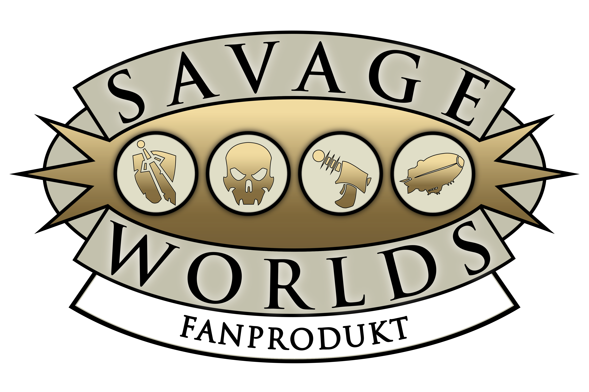

# Arga's SWADE Translation (German)

Dieses Modul übersetzt alle Kompendien-Inhalte des offiziellen ***SWADE Core Rules***-Moduls von Pinnacle für Foundry VTT zur Laufzeit ins Deutsche. Die Übersetzung läuft über das Modul ***Babele***, und die Originalinhalte werden dabei nicht verändert.
Die deutschsprachigen Texte basieren ausschließlich auf dem deutschen Grundregelwerk (SWAE) und dem ehemaligen Foundry-Modul ***Savage Worlds Abenteuer Edition Grundregelwerk*** von Ulisses. Letzteres hatte noch die 3. Auflage von SWAE als Grundlage. Die Texte im vorliegenden Modul werden in einem der nächsten Updates mit den Texten aus der aktuellen 6. Auflage aktualisiert.

## Voraussetzungen
- [Babele](https://foundryvtt.com/packages/babele) – Übersetzungs-Framework
- [SWADE-System](https://foundryvtt.com/packages/swade) – kostenloses Spielsystem
- [SWADE Core Rules](https://foundryvtt.com/packages/swade-core-rules) – kostenpflichtiges Premium-Modul von Pinnacle
  
## Rechte
**Savage Worlds** und **SWADE** sind Eigentum der **Pinnacle Entertainment Group**; die deutschsprachigen Rechte liegen bei **Ulisses Spiele**. Dieses inoffizielle Fan-Projekt liefert die deutschen Regeltexte von Ulisses Spiele (verwendet mit Genehmigung) als Babele-Übersetzung für das kostenpflichtige englische Originalmodul `swade-core-rules`, das installiert sein muss und nicht ersetzt wird.

  

